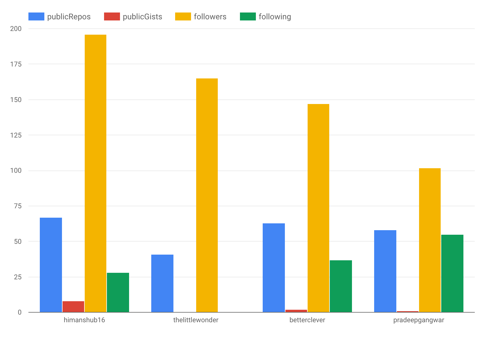
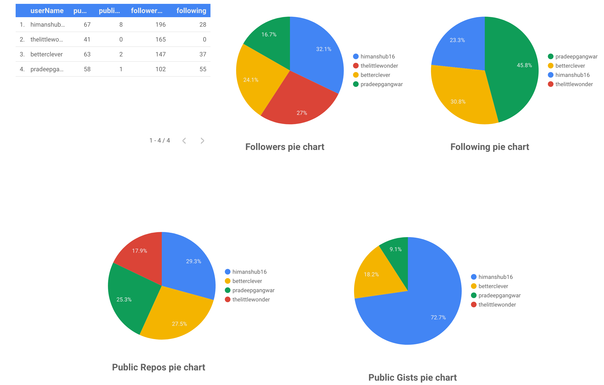

# GitHub Data Studio Connector

## Using the connector
To use this connector and make your own data studio reports. Follow these steps:

- Gain read access to the script follwing [this](https://script.google.com/d/138y0GCy0_4uWg_1X9cErrGw8GktBL7CZ6Wd3dpSv12heTmr7Fj__rxE8/edit?usp=sharing) link.
- Then follow [this](https://datastudio.google.com/datasources/create?connectorId=AKfycbwOr6m8cycw55CDkXrDOuT-1WLrG7z9kRDhXXPrNcE) link to create your own data source and report :smile:
- You can enter as many usernames you want to campare. But it is recommended to use less than 10 usernames to make it fast.

## Blogs and tutorials

- I will be publishing the blogs soon on "how to build your own Data Studio community connector. They are in draft mode :sweat_smile:
- Here is the first post. It intriduces you to how to use data studio and what is it. [[Link](https://greedforcode.blogspot.com/2019/06/developing-google-datastudio-connector.html)]

Follow [Greed For Code](https://greedforcode.blogspot.com) to get the tutorials when I post them.

## Report sample

Here is the link to report. [[Link](https://datastudio.google.com/open/12bEKeFvdEliSs8kO3O6fH1bsRzcX_lEL)]

### Samples

